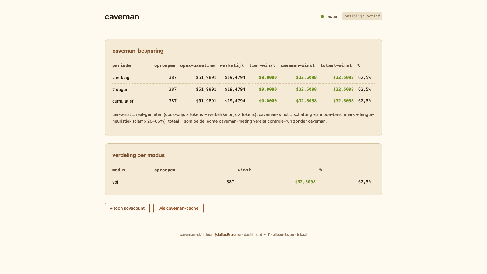

# savings-mirror — Nederlands

[](LICENSE)
[](Cargo.toml)
[](TEST-RESULTS.md)

Lokale, alleen-lezen USD-besparing-tracker voor de
[caveman](https://github.com/JuliusBrussee/caveman) Claude Code skill.

Leest je `~/.claude/projects/**/*.jsonl` transcripten, prijst de output-tokens
af tegen Anthropics publieke prijstabel, en toont wat je écht bespaard hebt
door (a) een goedkoper model-tier te kiezen en (b) caveman-compressie te
gebruiken. Per dag, 7 dagen, cumulatief, en per modus. Geen telemetrie, geen
netwerkverkeer, geen write-back — pure offline lezer.



> *Screenshot: brutalist mono dashboard op `http://127.0.0.1:8991/`.*

---

## Waarom

Caveman claimt ~65% reductie van output-tokens in `full` modus. Je hoeft die
claim niet blind te vertrouwen — `savings-mirror` meet hem op je eigen
transcripten en toont het dollar-verschil, opgesplitst in twee eerlijke lagen:

1. **tier-winst** — `if_opus_usd − actual_usd`. Echt gemeten: je koos
   Haiku/Sonnet boven Opus en bespaarde het verschil uit de publieke prijstabel.
2. **caveman-winst** — `if_opus_no_caveman_usd − if_opus_usd`. Schatting op
   basis van de per-call compressie-factor uit de modus-tracker hook. Exact
   meten zou een parallelle controlerun zonder caveman vereisen.

`totaal = tier + caveman`. Beide kolommen zijn zichtbaar, zodat je elke claim
los kan beoordelen.

---

## Installatie

### macOS app (aanbevolen)

```sh
git clone https://github.com/sovareq/savings-mirror.git
cd savings-mirror
./scripts/build-app.sh           # bouwt ~/Desktop/SavingsMirror.app
open ~/Desktop/SavingsMirror.app # menubar-app, start runtime automatisch
```

### Vanuit broncode

```sh
cargo build --release
./target/release/savings-mirror  # luistert op 127.0.0.1:8991
open http://127.0.0.1:8991
```

### Vanuit een release-tarball

Pak de meest recente `savings-mirror-<version>-<arch>.tar.gz` van de
[releases-pagina](https://github.com/sovareq/savings-mirror/releases),
pak uit, en start de binary.

---

## Naast Claude Code laten meedraaien

Voeg een `SessionStart`-hook toe aan `~/.claude/settings.json` zodat de runtime
automatisch start wanneer Claude Code opstart:

```json
{
  "hooks": {
    "SessionStart": [
      {
        "hooks": [
          {
            "type": "command",
            "command": "pgrep -f 'SavingsMirror.app/Contents/MacOS' >/dev/null || SAVINGS_MIRROR_NO_DASHBOARD=1 open -gj /Users/<jij>/Desktop/SavingsMirror.app",
            "timeout": 5
          }
        ]
      }
    ]
  }
}
```

De `pgrep`-guard maakt de hook idempotent. `SAVINGS_MIRROR_NO_DASHBOARD=1`
voorkomt dat de launcher elke sessie een browser-tab opent — open het
dashboard handmatig via het menubar-icoon (`SavingsMirror → Open dashboard`).

---

## Per-modus uitsplitsing

Caveman heeft lite/full/ultra/wenyan modi. `savings-mirror` registreert elke
modus-overgang via een Claude Code `UserPromptSubmit`-hook
(`~/.claude/hooks/savings-mirror-mode-logger.js`), en koppelt elk
assistant-bericht aan de modus die actief was op het moment van de call.

De *"verdeling per modus"*-sectie toont oproepen + USD bespaard per modus.
Modi met nul oproepen worden verborgen.

---

## Architectuur

```
~/.claude/projects/**/*.jsonl
            │
            ▼
   ┌────────────────────┐
   │  caveman.rs        │   parst assistant-berichten,
   │  build_report()    │   prijst via PRICE_TABLE,
   └─────────┬──────────┘   past per-modus-factor toe
             │
             ▼
   ┌────────────────────┐
   │  axum HTTP-server  │   /api/caveman    volledig rapport
   │  127.0.0.1:8991    │   /api/combined   + sovacount
   └─────────┬──────────┘   /api/reset      wis baseline
             │
             ▼
   ┌────────────────────┐
   │  dashboard.html    │   brutalist mono, pollt /api/combined
   │  (één bestand)     │   elke 15s, 10s server-side cache
   └────────────────────┘
```

- **Cache**: `build_report()` wordt 10 seconden gememoizeerd via
  `Mutex<Option<...>>`. Stopt een losgeslagen client (of een stale
  2s-pollende tab) van een volledige transcript-walk per request.
- **Baseline**: `~/.local/share/savings-mirror/baseline.txt` bewaart de
  "tel vanaf dit moment"-tijdsstempel. `POST /api/reset` herschrijft hem
  naar nu; de mode-history-truncate volgt direct maar is best-effort
  (niet-fataal op I/O-fout). De baseline-write is autoritatief.
- **Kost**: nul third-party crates buiten axum/tokio/chrono/walkdir/serde.

---

## API

| Endpoint        | Methode | Antwoord                                     |
|-----------------|---------|----------------------------------------------|
| `/`             | GET     | `dashboard.html`                             |
| `/health`       | GET     | `"ok"`                                       |
| `/api/caveman`  | GET     | Volledig `CavemanReport` (vandaag/7d/cum/per-modus) |
| `/api/sovacount`| GET     | SovaCount-totalen indien `:8989` bereikbaar  |
| `/api/combined` | GET     | Caveman + sovacount samengevoegd             |
| `/api/reset`    | POST    | Wis baseline + mode-history                  |

Alle endpoints geven HTTP 200 terug, ook bij falen — body bevat
`{"error": "..."}`. De frontend degradeert netjes zonder 500-handling.

`BIND_ADDR=0.0.0.0:8991 ./savings-mirror` toont het dashboard op het LAN.

---

## Wat het niet doet

- Geen write-back naar caveman, sovacount, of je transcripten.
- Geen telemetrie. Geen netwerk-calls. Geen analytics.
- Geen mutaties op schijf behalve `baseline.txt` + `mode-history.ndjson`
  onder `~/.local/share/savings-mirror/`, en `billing-mode-override`
  onder `~/.config/savings-mirror/` (gezet via de dashboard-pill-toggle).
- Geen model-invocaties — 100% offline transcript-parsing.

---

## Companion-tool: sovacount

[sovacount](https://github.com/sovareq/sovacount) is een apart proces dat
een `/cost`-endpoint blootstelt met tier-routing-besparingen (Haiku/Sonnet
vs Opus-baseline) voor prompts die je erdoor stuurt. `savings-mirror` pollt
dat endpoint post-hoc en voegt de totalen toe aan hetzelfde dashboard.

**Geen van beide tools onderschept LLM-verkeer.** sovacount classificeert
en logt; savings-mirror leest. Beide zijn pure consumenten van werk dat
al gebeurd is — geen proxy, geen man-in-the-middle, geen live-mutatie
van je API-calls.

---

## Licentie

MIT. Gebouwd als companion-tool bij [caveman](https://github.com/JuliusBrussee/caveman)
van @JuliusBrussee — niet gelieerd, geen garantie, geen support-contract.

Auteur: Bjorn Lambrechts ([Sovareq](https://sovareq.com)).
